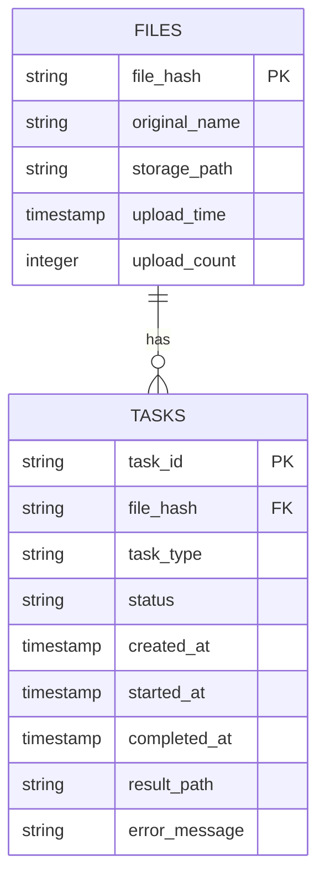

# 数据库模块介绍

## 1. 模块概述

数据库模块是音频处理系统的核心组件，提供了可靠的数据管理功能，确保系统高效运行。该模块基于 SQLite 数据库，设计用于管理音频文件信息和处理任务，支持文件去重、任务去重、状态跟踪等功能。

### 1.1 核心功能

- **文件管理**：存储和管理音频文件信息，防止重复处理
- **任务管理**：跟踪和管理处理任务，确保任务正确执行
- **状态跟踪**：详细记录任务的执行状态和结果
- **数据统计**：提供系统运行的统计信息
- **错误处理**：记录任务执行过程中的错误信息

### 1.2 技术特点

- **轻量级**：基于 SQLite 数据库，无需额外配置
- **高效**：优化的表结构和索引设计
- **可靠**：完整的事务支持和错误处理
- **可扩展**：模块化设计，易于扩展新功能
- **自包含**：内置数据库初始化和维护功能

## 2. 目录结构

```
database/
├── database.py           # 数据库核心模块
├── init_database.py      # 数据库初始化程序
├── INTEGRATION_GUIDE.md  # 集成指南
└── README.md            # 本文档
```

## 3. 数据库结构

### 3.1 表结构

#### files 表

| 字段名 | 数据类型 | 约束 | 描述 |
|--------|----------|------|------|
| `file_hash` | TEXT | PRIMARY KEY | 文件的唯一标识符（MD5 哈希值） |
| `original_name` | TEXT | | 文件的原始名称 |
| `storage_path` | TEXT | | 文件的存储路径 |
| `upload_time` | TIMESTAMP | DEFAULT CURRENT_TIMESTAMP | 文件上传时间 |
| `upload_count` | INTEGER | DEFAULT 1 | 文件上传次数 |

#### tasks 表

| 字段名 | 数据类型 | 约束 | 描述 |
|--------|----------|------|------|
| `task_id` | TEXT | PRIMARY KEY | 任务的唯一标识符 |
| `file_hash` | TEXT | NOT NULL | 关联的文件哈希值 |
| `task_type` | TEXT | NOT NULL | 任务类型 |
| `status` | TEXT | DEFAULT 'pending' | 任务状态 |
| `created_at` | TIMESTAMP | DEFAULT CURRENT_TIMESTAMP | 任务创建时间 |
| `started_at` | TIMESTAMP | | 任务开始时间 |
| `completed_at` | TIMESTAMP | | 任务完成时间 |
| `result_path` | TEXT | | 任务结果路径 |
| `error_message` | TEXT | | 错误信息 |
| `UNIQUE` | | (file_hash, task_type) | 防止重复任务 |

### 3.2 索引设计

| 索引名 | 表 | 字段 | 目的 |
|--------|------|------|------|
| `idx_tasks_file` | tasks | file_hash | 加速按文件查询任务 |
| `idx_tasks_type` | tasks | task_type | 加速按类型查询任务 |
| `idx_tasks_status` | tasks | status | 加速按状态查询任务 |

### 3.3 数据模型



## 4. 核心 API

### 4.1 文件操作

#### `check_file_exists(file_hash: str) -> bool`
检查文件是否已存在于数据库中。

**参数**：
- `file_hash`：文件的哈希值

**返回值**：
- `bool`：文件是否存在

#### `save_file_info(file_hash: str, original_name: str = None, storage_path: str = None) -> bool`
保存文件信息到数据库。

**参数**：
- `file_hash`：文件的哈希值
- `original_name`：文件的原始名称
- `storage_path`：文件的存储路径

**返回值**：
- `bool`：保存是否成功（文件不存在时返回 True）

#### `get_file_info(file_hash: str) -> Optional[Dict[str, Any]]`
获取文件信息。

**参数**：
- `file_hash`：文件的哈希值

**返回值**：
- `Dict`：文件信息字典
- `None`：文件不存在

#### `increment_upload_count(file_hash: str)`
增加文件的上传次数。

**参数**：
- `file_hash`：文件的哈希值

### 4.2 任务操作

#### `create_task(task_id: str, file_hash: str, task_type: str = "transcribe") -> bool`
创建新任务。

**参数**：
- `task_id`：任务的唯一标识符
- `file_hash`：关联的文件哈希值
- `task_type`：任务类型（默认：transcribe）

**返回值**：
- `bool`：创建是否成功（任务不存在时返回 True）

#### `get_task(task_id: str) -> Optional[Dict[str, Any]]`
获取任务信息。

**参数**：
- `task_id`：任务的唯一标识符

**返回值**：
- `Dict`：任务信息字典
- `None`：任务不存在

#### `find_task(file_hash: str, task_type: str) -> Optional[Dict[str, Any]]`
根据文件哈希和任务类型查找任务。

**参数**：
- `file_hash`：文件的哈希值
- `task_type`：任务类型

**返回值**：
- `Dict`：任务信息字典
- `None`：任务不存在

#### `update_task_status(task_id: str, status: str, result_path: str = None, error_message: str = None)`
更新任务状态。

**参数**：
- `task_id`：任务的唯一标识符
- `status`：新状态（pending, running, success, failed）
- `result_path`：结果文件路径（成功时使用）
- `error_message`：错误信息（失败时使用）

#### `get_file_tasks(file_hash: str) -> List[Dict[str, Any]]`
获取文件的所有任务。

**参数**：
- `file_hash`：文件的哈希值

**返回值**：
- `List[Dict]`：任务信息列表

### 4.3 统计和工具方法

#### `get_stats() -> Dict[str, Any]`
获取数据库统计信息。

**返回值**：
- `Dict`：包含文件数量和任务统计的字典

#### `cleanup_old_data(days: int = 30)`
清理指定天数前的失败任务。

**参数**：
- `days`：天数，默认 30

## 5. 任务类型

| 任务类型 | 描述 | 适用模块 |
|----------|------|----------|
| `extract_audio` | 从视频中提取音频 | 视频处理模块 |
| `transcribe` | 音频转录为文本 | 转录模块 |
| `ai_summarize` | AI 生成文本总结 | AI 总结模块 |
| `extract_keyframes` | 提取视频关键帧 | 视频处理模块 |

## 6. 任务状态

| 状态 | 描述 | 转换路径 |
|------|------|----------|
| `pending` | 任务已创建但未开始 | 初始状态 |
| `running` | 任务正在执行中 | pending → running |
| `success` | 任务执行成功 | running → success |
| `failed` | 任务执行失败 | running → failed |

## 7. 初始化和配置

### 7.1 数据库初始化

数据库模块内置了自动初始化功能，首次使用时会自动创建数据库文件和表结构。也可以使用专用的初始化程序：

```bash
# 基本初始化
python database/init_database.py

# 重置数据库
python database/init_database.py --reset

# 清空数据
python database/init_database.py --clear

# 查看统计信息
python database/init_database.py --stats
```

### 7.2 配置选项

数据库模块的配置相对简单，主要包括：

| 配置项 | 描述 | 默认值 |
|--------|------|--------|
| `db_path` | 数据库文件路径 | `../app.db` |
| `timeout` | 数据库连接超时时间 | 10 秒 |

### 7.3 环境要求

- **Python 版本**：3.7+
- **依赖库**：标准库（sqlite3）
- **文件系统**：支持 SQLite 数据库文件

## 8. 使用示例

### 8.1 基本使用

```python
from database import db
import hashlib
import uuid
import os

def process_audio(audio_path):
    """处理音频文件的完整流程"""
    # 1. 计算文件哈希
    def calculate_file_hash(file_path):
        hash_md5 = hashlib.md5()
        with open(file_path, "rb") as f:
            for chunk in iter(lambda: f.read(4096), b""):
                hash_md5.update(chunk)
        return hash_md5.hexdigest()
    
    file_hash = calculate_file_hash(audio_path)
    original_name = os.path.basename(audio_path)
    storage_path = audio_path
    
    # 2. 检查文件是否已处理
    if db.check_file_exists(file_hash):
        print(f"文件 {original_name} 已处理过，跳过")
        return None
    
    # 3. 保存文件信息
    db.save_file_info(file_hash, original_name, storage_path)
    
    # 4. 创建转录任务
    transcribe_task_id = f"transcribe_{uuid.uuid4().hex[:8]}"
    db.create_task(transcribe_task_id, file_hash, "transcribe")
    
    # 5. 执行转录
    db.update_task_status(transcribe_task_id, "running")
    
    try:
        # 模拟转录逻辑
        print(f"正在转录文件: {original_name}")
        import time
        time.sleep(2)  # 模拟处理时间
        transcript_path = f"{audio_path}_transcript.txt"
        
        # 创建转录结果文件
        with open(transcript_path, "w", encoding="utf-8") as f:
            f.write(f"Transcript for {original_name}\n")
            f.write("This is a sample transcript.\n")
        
        # 6. 标记转录成功
        db.update_task_status(transcribe_task_id, "success", transcript_path)
        
        # 7. 创建 AI 总结任务
        summarize_task_id = f"summarize_{uuid.uuid4().hex[:8]}"
        db.create_task(summarize_task_id, file_hash, "ai_summarize")
        
        # 8. 执行 AI 总结
        db.update_task_status(summarize_task_id, "running")
        
        # 模拟 AI 总结逻辑
        print(f"正在生成 AI 总结: {original_name}")
        time.sleep(3)  # 模拟处理时间
        summary_path = f"{audio_path}_summary.md"
        
        # 创建总结结果文件
        with open(summary_path, "w", encoding="utf-8") as f:
            f.write(f"# Summary for {original_name}\n")
            f.write("This is a sample AI summary.\n")
        
        # 9. 标记总结成功
        db.update_task_status(summarize_task_id, "success", summary_path)
        
        return {
            "transcript_path": transcript_path,
            "summary_path": summary_path
        }
        
    except Exception as e:
        # 10. 标记任务失败
        db.update_task_status(transcribe_task_id, "failed", error_message=str(e))
        print(f"处理失败: {e}")
        return None

# 示例使用
if __name__ == "__main__":
    # 处理示例音频文件
    result = process_audio("sample_audio.mp3")
    if result:
        print(f"转录结果: {result['transcript_path']}")
        print(f"AI 总结: {result['summary_path']}")
    
    # 获取数据库统计信息
    stats = db.get_stats()
    print(f"\n数据库统计信息:")
    print(f"文件数量: {stats['files']}")
    print(f"任务数量: {stats['tasks']}")
    print(f"任务状态: {stats['task_status']}")
```

### 8.2 批量处理

```python
from database import db
import os

def batch_process_audio_files(audio_dir):
    """批量处理目录中的音频文件"""
    results = []
    
    # 获取目录中的所有音频文件
    audio_files = []
    for file in os.listdir(audio_dir):
        if file.endswith(('.mp3', '.wav', '.flac', '.m4a')):
            audio_files.append(os.path.join(audio_dir, file))
    
    print(f"找到 {len(audio_files)} 个音频文件")
    
    for i, audio_file in enumerate(audio_files, 1):
        print(f"\n处理文件 {i}/{len(audio_files)}: {os.path.basename(audio_file)}")
        result = process_audio(audio_file)  # 使用上面定义的函数
        results.append(result)
    
    # 输出统计信息
    stats = db.get_stats()
    print(f"\n处理完成！")
    print(f"文件总数: {stats['files']}")
    print(f"任务统计: {stats['tasks']}")
    
    # 统计成功和失败的数量
    success_count = sum(1 for r in results if r)
    failed_count = len(results) - success_count
    print(f"成功: {success_count}, 失败: {failed_count}")
    
    return results

# 示例使用
if __name__ == "__main__":
    batch_process_audio_files("audio_files")
```

### 8.3 状态查询

```python
from database import db

def check_task_status(task_id):
    """检查任务执行状态"""
    task = db.get_task(task_id)
    if not task:
        return "任务不存在"
    
    status = task['status']
    if status == 'success':
        return f"任务成功完成，结果路径: {task['result_path']}"
    elif status == 'failed':
        return f"任务失败，错误: {task['error_message']}"
    elif status == 'running':
        return "任务正在执行中"
    else:
        return "任务等待执行"

def get_file_process_history(file_hash):
    """获取文件的处理历史"""
    tasks = db.get_file_tasks(file_hash)
    if not tasks:
        return "文件未处理过"
    
    history = []
    for task in tasks:
        status_display = {
            'pending': '等待执行',
            'running': '执行中',
            'success': '成功',
            'failed': '失败'
        }.get(task['status'], task['status'])
        
        task_type_display = {
            'extract_audio': '提取音频',
            'transcribe': '转录',
            'ai_summarize': 'AI 总结',
            'extract_keyframes': '提取关键帧'
        }.get(task['task_type'], task['task_type'])
        
        history.append(f"{task_type_display}: {status_display}")
    
    return "\n".join(history)

# 示例使用
if __name__ == "__main__":
    # 检查任务状态
    task_id = "transcribe_12345678"
    print(f"任务 {task_id} 状态: {check_task_status(task_id)}")
    
    # 检查文件处理历史
    file_hash = "example_file_hash"
    print(f"文件处理历史:\n{get_file_process_history(file_hash)}")
```

## 9. 性能优化

### 9.1 索引使用

数据库已经为以下字段创建了索引，应充分利用这些索引来提高查询性能：

- `tasks.file_hash`：查询特定文件的任务时使用
- `tasks.task_type`：查询特定类型的任务时使用
- `tasks.status`：查询特定状态的任务时使用

### 9.2 批量操作

对于大量数据操作，建议使用批量处理以提高性能：

```python
def batch_save_files(file_infos):
    """批量保存文件信息"""
    from database import FileDB
    
    db_instance = FileDB()
    conn = db_instance._get_conn()
    
    try:
        conn.execute('BEGIN TRANSACTION')
        
        for file_info in file_infos:
            file_hash = file_info['file_hash']
            original_name = file_info['original_name']
            storage_path = file_info['storage_path']
            
            conn.execute(
                "INSERT OR IGNORE INTO files (file_hash, original_name, storage_path) VALUES (?, ?, ?)",
                (file_hash, original_name, storage_path)
            )
        
        conn.execute('COMMIT')
        return True
    except Exception as e:
        conn.execute('ROLLBACK')
        print(f"批量保存失败: {e}")
        return False
    finally:
        conn.close()
```

### 9.3 缓存策略

对于频繁访问的数据，可以使用内存缓存：

```python
class TaskCache:
    """任务缓存类"""
    def __init__(self):
        self.cache = {}
        self.expiry = {}
    
    def get_task(self, task_id):
        """获取缓存的任务信息"""
        import time
        
        if task_id in self.cache:
            # 检查是否过期（5分钟）
            if time.time() - self.expiry.get(task_id, 0) < 300:
                return self.cache[task_id]
            else:
                del self.cache[task_id]
                del self.expiry[task_id]
        
        # 从数据库获取
        from database import db
        task = db.get_task(task_id)
        if task:
            self.cache[task_id] = task
            self.expiry[task_id] = time.time()
        
        return task

# 使用缓存
task_cache = TaskCache()
task = task_cache.get_task(task_id)
```

## 10. 故障排除

### 10.1 常见错误

| 错误 | 原因 | 解决方案 |
|------|------|----------|
| `UNIQUE constraint failed` | 重复任务 | 使用 `find_task` 检查任务是否存在 |
| `Database is locked` | 并发访问 | 确保连接正确关闭，使用短事务 |
| `No such table` | 数据库未初始化 | 确保正确导入数据库模块，会自动初始化 |
| `OperationError` | 文件权限 | 确保数据库文件有写入权限 |

### 10.2 诊断命令

```bash
# 检查数据库结构
python database/init_database.py --stats

# 重置数据库（如果损坏）
python database/init_database.py --reset

# 检查数据库文件是否存在
ls -la app.db
```

### 10.3 日志输出

数据库模块会生成详细的操作日志，帮助排查问题：

```
2026-02-09 18:51:07,723 - INFO - 数据库初始化完成: app.db
2026-02-09 18:51:07,922 - INFO - 文件保存成功: abc123def456
2026-02-09 18:51:07,976 - INFO - 任务创建成功: task-001 (extract_audio)
2026-02-09 18:51:08,024 - INFO - 任务开始: task-001
2026-02-09 18:51:08,027 - INFO - 任务成功完成: task-001
```

## 11. 扩展功能

### 11.1 添加新的任务类型

1. **定义任务类型常量**：

```python
# 在 constants.py 中
TASK_TYPES = {
    'EXTRACT_AUDIO': 'extract_audio',
    'TRANSCRIBE': 'transcribe',
    'AI_SUMMARIZE': 'ai_summarize',
    'EXTRACT_KEYFRAMES': 'extract_keyframes',
    'NEW_TASK_TYPE': 'new_task_type'  # 新任务类型
}
```

2. **在相关模块中使用**：

```python
from constants import TASK_TYPES

db.create_task(task_id, file_hash, TASK_TYPES['NEW_TASK_TYPE'])
```

### 11.2 扩展数据库表

如果需要添加新的字段或表：

1. **修改 `database.py` 中的 `_init_db` 方法**：

```python
def _init_db(self):
    """创建数据库表（如果不存在）"""
    with self._get_conn() as conn:
        # 现有表结构...
        
        # 添加新表或字段
        conn.execute('''
            CREATE TABLE IF NOT EXISTS new_table (
                id INTEGER PRIMARY KEY,
                name TEXT,
                value TEXT
            )
        ''')
        
        conn.commit()
```

2. **添加相应的 API 方法**：

```python
def add_new_record(self, name, value):
    """添加新记录"""
    with self._get_conn() as conn:
        conn.execute(
            "INSERT INTO new_table (name, value) VALUES (?, ?)",
            (name, value)
        )
        conn.commit()
```

## 12. 最佳实践

### 12.1 文件哈希计算

**推荐方法**：使用文件内容的 MD5 哈希值

```python
import hashlib

def calculate_file_hash(file_path):
    """计算文件的 MD5 哈希值"""
    hash_md5 = hashlib.md5()
    with open(file_path, "rb") as f:
        for chunk in iter(lambda: f.read(4096), b""):
            hash_md5.update(chunk)
    return hash_md5.hexdigest()
```

### 12.2 任务 ID 生成

**推荐方法**：使用 UUID 生成唯一的任务 ID

```python
import uuid

def generate_task_id(task_type):
    """生成唯一的任务 ID"""
    return f"{task_type}_{uuid.uuid4().hex[:8]}"
```

### 12.3 错误处理

**推荐方法**：使用 try-except 块捕获异常，并更新任务状态

```python
try:
    # 任务执行逻辑
    db.update_task_status(task_id, "success", result_path)
except Exception as e:
    db.update_task_status(task_id, "failed", error_message=str(e))
    print(f"任务失败: {e}")
```

### 12.4 定期维护

**推荐方法**：定期清理旧的失败任务

```python
def scheduled_maintenance():
    """定期维护任务"""
    from database import db
    
    # 清理 30 天前的失败任务
    db.cleanup_old_data(days=30)
    
    # 获取统计信息
    stats = db.get_stats()
    print(f"维护完成！\n文件总数: {stats['files']}\n任务统计: {stats['tasks']}")
```

## 13. 监控和维护

### 13.1 监控指标

| 指标 | 描述 | 监控频率 |
|------|------|----------|
| 文件总数 | 数据库中的文件数量 | 每日 |
| 任务总数 | 数据库中的任务数量 | 每日 |
| 失败任务数 | 失败的任务数量 | 每日 |
| 数据库大小 | 数据库文件的大小 | 每周 |

### 13.2 维护计划

| 维护任务 | 描述 | 执行频率 |
|----------|------|----------|
| 清理失败任务 | 清理 30 天前的失败任务 | 每周 |
| 备份数据库 | 备份数据库文件 | 每周 |
| 检查数据库完整性 | 检查数据库文件是否损坏 | 每月 |

### 13.3 备份策略

1. **手动备份**：
   ```bash
   # 复制数据库文件
   cp app.db app.db.backup
   ```

2. **自动备份**：
   ```python
   def backup_database():
       """备份数据库"""
       import shutil
       import datetime
       
       timestamp = datetime.datetime.now().strftime("%Y%m%d_%H%M%S")
       backup_path = f"app.db.backup.{timestamp}"
       
       try:
           shutil.copy2("app.db", backup_path)
           print(f"数据库备份成功: {backup_path}")
           return True
       except Exception as e:
           print(f"数据库备份失败: {e}")
           return False
   ```

## 14. 总结

数据库模块是音频处理系统的重要组成部分，提供了可靠的数据管理功能，确保系统高效运行。通过本文档，您应该能够：

1. **理解模块功能**：了解数据库模块的核心功能和技术特点
2. **掌握使用方法**：学会如何使用数据库 API 管理文件和任务
3. **优化性能**：应用最佳实践提高系统性能
4. **扩展功能**：根据需要扩展数据库功能
5. **维护系统**：定期维护和监控数据库状态

数据库模块的设计考虑了性能、可靠性和可扩展性，为音频处理系统提供了坚实的数据管理基础。通过合理使用和维护，可以确保系统长期稳定运行，为用户提供优质的音频处理服务。

---

**✨ 数据库模块介绍 v1.0**
