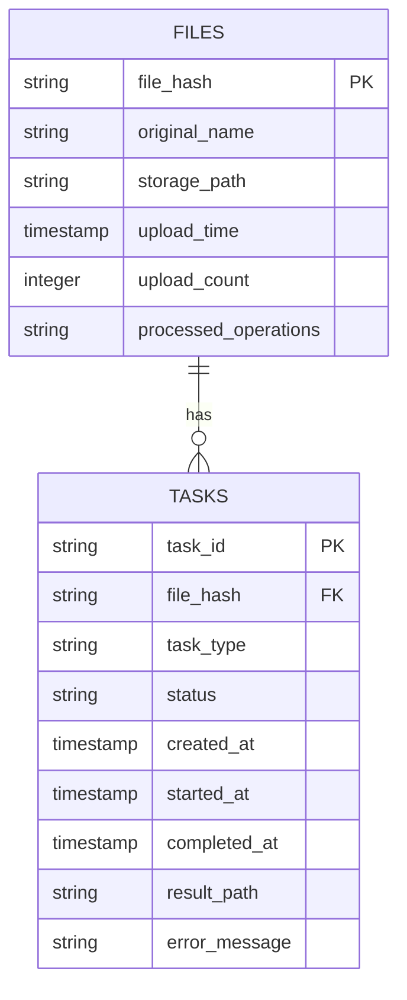

# 数据库模块介绍

## 1. 模块概述

数据库模块是音频处理系统的核心组件，提供了可靠的数据管理功能，确保系统高效运行。该模块基于 SQLite 数据库，设计用于管理音频文件信息和处理任务，支持文件去重、任务去重、状态跟踪等功能。

### 1.1 核心功能

- **文件管理**：存储和管理音频文件信息，防止重复处理
- **任务管理**：跟踪和管理处理任务，确保任务正确执行
- **状态跟踪**：详细记录任务的执行状态和结果
- **操作追踪**：记录文件已执行的所有处理操作，支持快速查询
- **数据统计**：提供系统运行的统计信息
- **错误处理**：记录任务执行过程中的错误信息

### 1.2 技术特点

- **轻量级**：基于 SQLite 数据库，无需额外配置
- **高效**：优化的表结构和索引设计
- **可靠**：完整的事务支持和错误处理
- **可扩展**：模块化设计，易于扩展新功能
- **自包含**：内置数据库初始化和维护功能

## 2. 目录结构

```
database/
├── database.py           # 数据库核心模块
├── init_database.py      # 数据库初始化程序
└── README.md            # 本文档
```

### 2.1 文件说明

| 文件名 | 描述 | 用途 |
|--------|------|------|
| `database.py` | 数据库核心模块 | 提供完整的数据库操作 API |
| `init_database.py` | 数据库初始化程序 | 负责数据库结构的创建和维护 |
| `README.md` | 本文档 | 提供数据库模块的全面介绍 |

## 3. 数据库结构

### 3.1 表结构

#### files 表

| 字段名 | 数据类型 | 约束 | 描述 |
|--------|----------|------|------|
| `file_hash` | TEXT | PRIMARY KEY | 文件的唯一标识符（MD5 哈希值），用于文件去重 |
| `original_name` | TEXT | | 文件的原始名称，保留用户上传时的文件名 |
| `storage_path` | TEXT | | 文件的存储路径，指向实际文件位置 |
| `upload_time` | TIMESTAMP | DEFAULT CURRENT_TIMESTAMP | 文件上传时间，自动记录 |
| `upload_count` | INTEGER | DEFAULT 1 | 文件上传次数，用于统计重复上传 |
| `processed_operations` | TEXT | DEFAULT '{}' | 文件已执行的处理操作（JSON 格式），包含操作类型、状态、结果路径等信息 |

#### tasks 表

| 字段名 | 数据类型 | 约束 | 描述 |
|--------|----------|------|------|
| `task_id` | TEXT | PRIMARY KEY | 任务的唯一标识符，格式为 `{task_type}_{uuid}` |
| `file_hash` | TEXT | NOT NULL | 关联的文件哈希值，外键引用 files 表 |
| `task_type` | TEXT | NOT NULL | 任务类型（如 extract_audio, transcribe, ai_summarize） |
| `status` | TEXT | DEFAULT 'pending' | 任务状态（pending, running, success, failed） |
| `created_at` | TIMESTAMP | DEFAULT CURRENT_TIMESTAMP | 任务创建时间 |
| `started_at` | TIMESTAMP | | 任务开始执行的时间 |
| `completed_at` | TIMESTAMP | | 任务完成的时间 |
| `result_path` | TEXT | | 任务执行结果的文件路径 |
| `error_message` | TEXT | | 任务失败时的错误信息 |
| `UNIQUE` | | (file_hash, task_type) | 唯一约束，防止对同一文件重复创建相同类型的任务 |

### 3.2 索引设计

| 索引名 | 表 | 字段 | 目的 | 性能影响 |
|--------|------|------|------|----------|
| `idx_tasks_file` | tasks | file_hash | 加速按文件查询任务 | 大幅提高文件相关任务的查询速度 |
| `idx_tasks_type` | tasks | task_type | 加速按类型查询任务 | 提高任务类型筛选的性能 |
| `idx_tasks_status` | tasks | status | 加速按状态查询任务 | 提高任务状态筛选的性能 |
| `idx_tasks_file_type` | tasks | (file_hash, task_type) | 支持唯一约束和组合查询 | 确保任务唯一性，加速组合条件查询 |

### 3.3 数据模型



### 3.4 数据存储格式

#### processed_operations 字段格式

```json
{
  "extract_audio": {
    "status": "completed",
    "result_path": "/path/to/audio.wav",
    "completed_at": "2026-02-10T10:30:00"
  },
  "transcribe": {
    "status": "completed",
    "result_path": "/path/to/transcript.txt",
    "completed_at": "2026-02-10T10:35:00"
  },
  "ai_summarize": {
    "status": "completed",
    "result_path": "/path/to/summary.md",
    "completed_at": "2026-02-10T10:40:00"
  }
}
```

## 4. 核心 API

### 4.1 文件操作

#### `check_file_exists(file_hash: str) -> bool`
检查文件是否已存在于数据库中。

**参数**：
- `file_hash`：文件的哈希值

**返回值**：
- `bool`：文件是否存在

#### `save_file_info(file_hash: str, original_name: str = None, storage_path: str = None) -> bool`
保存文件信息到数据库。

**参数**：
- `file_hash`：文件的哈希值
- `original_name`：文件的原始名称
- `storage_path`：文件的存储路径

**返回值**：
- `bool`：保存是否成功（文件不存在时返回 True）

#### `get_file_info(file_hash: str) -> Optional[Dict[str, Any]]`
获取文件信息。

**参数**：
- `file_hash`：文件的哈希值

**返回值**：
- `Dict`：文件信息字典
- `None`：文件不存在

#### `increment_upload_count(file_hash: str) -> bool`
增加文件的上传次数，用于统计重复上传的情况。

**参数**：
- `file_hash`：文件的哈希值

**返回值**：
- `bool`：操作是否成功

**使用场景**：
当用户重复上传同一文件时，记录上传次数，便于统计和分析用户行为。

#### `update_processed_operation(file_hash: str, operation: str, status: str = "completed", result_path: str = None, completed_at: str = None) -> bool`
更新文件的处理操作状态，记录操作的执行情况。

**参数**：
- `file_hash`：文件的哈希值
- `operation`：操作类型（如 extract_audio, transcribe, ai_summarize）
- `status`：操作状态（completed, failed, in_progress），默认 completed
- `result_path`：结果文件路径，默认 None
- `completed_at`：完成时间，默认当前时间

**返回值**：
- `bool`：更新是否成功

**使用场景**：
当文件处理操作完成、失败或开始执行时，更新操作状态，便于后续查询和流程控制。

#### `get_processed_operations(file_hash: str) -> Dict[str, Any]`
获取文件的所有处理操作，返回完整的操作历史记录。

**参数**：
- `file_hash`：文件的哈希值

**返回值**：
- `Dict`：处理操作字典，键为操作类型，值为操作信息

**使用场景**：
需要查看文件的完整处理历史，或基于历史操作状态做出决策时使用。

#### `has_operation_completed(file_hash: str, operation: str) -> bool`
检查特定操作是否已完成，用于判断是否需要重复执行该操作。

**参数**：
- `file_hash`：文件的哈希值
- `operation`：操作类型

**返回值**：
- `bool`：操作是否已完成

**使用场景**：
在执行处理操作前检查该操作是否已经完成，避免重复处理，提高系统效率。

#### `remove_processed_operation(file_hash: str, operation: str) -> bool`
移除文件的特定处理操作，用于清除旧的操作记录或准备重新执行该操作。

**参数**：
- `file_hash`：文件的哈希值
- `operation`：操作类型

**返回值**：
- `bool`：移除是否成功

**使用场景**：
当需要重新执行某个操作时，先移除旧的操作记录，以便系统能够重新处理该操作。

### 4.2 任务操作

#### `create_task(task_id: str, file_hash: str, task_type: str = "transcribe") -> bool`
创建新任务，用于跟踪文件的处理过程。

**参数**：
- `task_id`：任务的唯一标识符
- `file_hash`：关联的文件哈希值
- `task_type`：任务类型（默认：transcribe）

**返回值**：
- `bool`：创建是否成功（任务不存在时返回 True）

**使用场景**：
当需要处理一个文件时，创建对应的任务记录，以便跟踪处理进度和结果。

#### `get_task(task_id: str) -> Optional[Dict[str, Any]]`
获取任务信息，返回任务的详细状态和执行情况。

**参数**：
- `task_id`：任务的唯一标识符

**返回值**：
- `Dict`：任务信息字典
- `None`：任务不存在

**使用场景**：
需要查询特定任务的执行状态、结果路径或错误信息时使用。

#### `find_task(file_hash: str, task_type: str) -> Optional[Dict[str, Any]]`
根据文件哈希和任务类型查找任务，用于检查特定类型的任务是否已存在。

**参数**：
- `file_hash`：文件的哈希值
- `task_type`：任务类型

**返回值**：
- `Dict`：任务信息字典
- `None`：任务不存在

**使用场景**：
在创建新任务前，检查是否已经存在相同类型的任务，避免重复创建。

#### `update_task_status(task_id: str, status: str, result_path: str = None, error_message: str = None) -> bool`
更新任务状态，记录任务的执行进度和结果。

**参数**：
- `task_id`：任务的唯一标识符
- `status`：新状态（pending, running, success, failed）
- `result_path`：结果文件路径（成功时使用）
- `error_message`：错误信息（失败时使用）

**返回值**：
- `bool`：更新是否成功

**使用场景**：
当任务开始执行、执行完成或执行失败时，更新任务状态，确保任务状态与实际情况同步。

#### `get_file_tasks(file_hash: str) -> List[Dict[str, Any]]`
获取文件的所有任务，返回该文件的完整任务历史。

**参数**：
- `file_hash`：文件的哈希值

**返回值**：
- `List[Dict]`：任务信息列表

**使用场景**：
需要查看文件的所有处理任务，了解文件的完整处理历史时使用。

### 4.3 统计和工具方法

#### `get_stats() -> Dict[str, Any]`
获取数据库统计信息，了解系统的整体运行状态。

**返回值**：
- `Dict`：包含文件数量和任务统计的字典

**使用场景**：
需要监控系统运行状态，或生成系统报告时使用。

#### `cleanup_old_data(days: int = 30) -> bool`
清理指定天数前的失败任务，保持数据库的清洁和高效。

**参数**：
- `days`：天数，默认 30

**返回值**：
- `bool`：清理是否成功

**使用场景**：
定期执行数据库维护，清理过时的失败任务记录，减少数据库大小，提高查询性能。

## 5. 任务类型

| 任务类型 | 描述 | 适用模块 |
|----------|------|----------|
| `extract_audio` | 从视频中提取音频 | 视频处理模块 |
| `transcribe` | 音频转录为文本 | 转录模块 |
| `ai_summarize` | AI 生成文本总结 | AI 总结模块 |
| `extract_keyframes` | 提取视频关键帧 | 视频处理模块 |

## 6. 任务状态

| 状态 | 描述 | 转换路径 |
|------|------|----------|
| `pending` | 任务已创建但未开始 | 初始状态 |
| `running` | 任务正在执行中 | pending → running |
| `success` | 任务执行成功 | running → success |
| `failed` | 任务执行失败 | running → failed |

## 7. 初始化和配置

### 7.1 数据库初始化

数据库模块内置了自动初始化功能，首次使用时会自动创建数据库文件和表结构。也可以使用专用的初始化程序：

```bash
# 基本初始化
python database/init_database.py

# 重置数据库
python database/init_database.py --reset

# 清空数据
python database/init_database.py --clear

# 查看统计信息
python database/init_database.py --stats
```

### 7.2 配置选项

数据库模块的配置相对简单，主要包括：

| 配置项 | 描述 | 默认值 |
|--------|------|--------|
| `db_path` | 数据库文件路径 | `../app.db` |
| `timeout` | 数据库连接超时时间 | 10 秒 |

### 7.3 环境要求

- **Python 版本**：3.7+
- **依赖库**：标准库（sqlite3）
- **文件系统**：支持 SQLite 数据库文件

## 8. 使用示例

### 8.1 基本使用

#### 8.1.1 文件处理操作管理

```python
from database.database import db
import hashlib
import uuid
import os

# 计算文件哈希
def calculate_file_hash(file_path):
    hash_md5 = hashlib.md5()
    with open(file_path, "rb") as f:
        for chunk in iter(lambda: f.read(4096), b""):
            hash_md5.update(chunk)
    return hash_md5.hexdigest()

# 示例文件
file_path = "sample_audio.mp3"
file_hash = calculate_file_hash(file_path)

# 1. 保存文件信息
db.save_file_info(file_hash, "sample_audio.mp3", file_path)

# 2. 检查文件是否已执行特定操作
if db.has_operation_completed(file_hash, "transcribe"):
    print("转录操作已完成，跳过")
else:
    print("执行转录操作...")
    # 执行转录逻辑
    # 完成后更新处理操作
    db.update_processed_operation(
        file_hash=file_hash,
        operation="transcribe",
        status="completed",
        result_path="/path/to/transcript.txt"
    )

# 3. 检查并执行 AI 总结
if db.has_operation_completed(file_hash, "transcribe") and not db.has_operation_completed(file_hash, "ai_summarize"):
    print("执行 AI 总结操作...")
    # 执行 AI 总结逻辑
    # 完成后更新处理操作
    db.update_processed_operation(
        file_hash=file_hash,
        operation="ai_summarize",
        status="completed",
        result_path="/path/to/summary.md"
    )

# 4. 获取文件的所有处理操作
operations = db.get_processed_operations(file_hash)
print("\n文件的处理操作:")
for op, info in operations.items():
    print(f"  - {op}: {info['status']}")
    if info.get('result_path'):
        print(f"    结果路径: {info['result_path']}")
    if info.get('completed_at'):
        print(f"    完成时间: {info['completed_at']}")

# 5. 移除特定处理操作（如需重新执行）
db.remove_processed_operation(file_hash, "ai_summarize")
print("\n移除 AI 总结操作后:")
operations = db.get_processed_operations(file_hash)
print(f"AI 总结操作存在: {'ai_summarize' in operations}")
```

### 8.2 批量处理

```python
from database import db
import hashlib
import uuid
import os

def process_audio(audio_path):
    """处理音频文件的完整流程"""
    # 1. 计算文件哈希
    def calculate_file_hash(file_path):
        hash_md5 = hashlib.md5()
        with open(file_path, "rb") as f:
            for chunk in iter(lambda: f.read(4096), b""):
                hash_md5.update(chunk)
        return hash_md5.hexdigest()
    
    file_hash = calculate_file_hash(audio_path)
    original_name = os.path.basename(audio_path)
    storage_path = audio_path
    
    # 2. 检查文件是否已处理
    if db.check_file_exists(file_hash):
        print(f"文件 {original_name} 已处理过，跳过")
        return None
    
    # 3. 保存文件信息
    db.save_file_info(file_hash, original_name, storage_path)
    
    # 4. 创建转录任务
    transcribe_task_id = f"transcribe_{uuid.uuid4().hex[:8]}"
    db.create_task(transcribe_task_id, file_hash, "transcribe")
    
    # 5. 执行转录
    db.update_task_status(transcribe_task_id, "running")
    
    try:
        # 模拟转录逻辑
        print(f"正在转录文件: {original_name}")
        import time
        time.sleep(2)  # 模拟处理时间
        transcript_path = f"{audio_path}_transcript.txt"
        
        # 创建转录结果文件
        with open(transcript_path, "w", encoding="utf-8") as f:
            f.write(f"Transcript for {original_name}\n")
            f.write("This is a sample transcript.\n")
        
        # 6. 标记转录成功
        db.update_task_status(transcribe_task_id, "success", transcript_path)
        
        # 7. 创建 AI 总结任务
        summarize_task_id = f"summarize_{uuid.uuid4().hex[:8]}"
        db.create_task(summarize_task_id, file_hash, "ai_summarize")
        
        # 8. 执行 AI 总结
        db.update_task_status(summarize_task_id, "running")
        
        # 模拟 AI 总结逻辑
        print(f"正在生成 AI 总结: {original_name}")
        time.sleep(3)  # 模拟处理时间
        summary_path = f"{audio_path}_summary.md"
        
        # 创建总结结果文件
        with open(summary_path, "w", encoding="utf-8") as f:
            f.write(f"# Summary for {original_name}\n")
            f.write("This is a sample AI summary.\n")
        
        # 9. 标记总结成功
        db.update_task_status(summarize_task_id, "success", summary_path)
        
        return {
            "transcript_path": transcript_path,
            "summary_path": summary_path
        }
        
    except Exception as e:
        # 10. 标记任务失败
        db.update_task_status(transcribe_task_id, "failed", error_message=str(e))
        print(f"处理失败: {e}")
        return None

# 示例使用
if __name__ == "__main__":
    # 处理示例音频文件
    result = process_audio("sample_audio.mp3")
    if result:
        print(f"转录结果: {result['transcript_path']}")
        print(f"AI 总结: {result['summary_path']}")
    
    # 获取数据库统计信息
    stats = db.get_stats()
    print(f"\n数据库统计信息:")
    print(f"文件数量: {stats['files']}")
    print(f"任务数量: {stats['tasks']}")
    print(f"任务状态: {stats['task_status']}")
```

### 8.2 批量处理

```python
from database import db
import os
import hashlib

def calculate_file_hash(file_path):
    """计算文件的 MD5 哈希值"""
    hash_md5 = hashlib.md5()
    with open(file_path, "rb") as f:
        for chunk in iter(lambda: f.read(4096), b""):
            hash_md5.update(chunk)
    return hash_md5.hexdigest()

def batch_process_audio_files(audio_dir):
    """批量处理目录中的音频文件，智能跳过已完成的操作"""
    results = []
    processed_count = 0
    skipped_count = 0
    
    # 获取目录中的所有音频文件
    audio_files = []
    for file in os.listdir(audio_dir):
        if file.endswith(('.mp3', '.wav', '.flac', '.m4a')):
            audio_files.append(os.path.join(audio_dir, file))
    
    print(f"找到 {len(audio_files)} 个音频文件")
    
    for i, audio_file in enumerate(audio_files, 1):
        print(f"\n处理文件 {i}/{len(audio_files)}: {os.path.basename(audio_file)}")
        
        # 计算文件哈希
        file_hash = calculate_file_hash(audio_file)
        original_name = os.path.basename(audio_file)
        
        # 保存文件信息
        db.save_file_info(file_hash, original_name, audio_file)
        
        # 检查并执行转录
        if not db.has_operation_completed(file_hash, "transcribe"):
            print("  执行转录操作...")
            # 执行转录逻辑
            # 完成后更新处理操作
            db.update_processed_operation(
                file_hash=file_hash,
                operation="transcribe",
                status="completed",
                result_path=f"/path/to/{original_name}_transcript.txt"
            )
            processed_count += 1
        else:
            print("  转录操作已完成，跳过")
            skipped_count += 1
        
        # 检查并执行 AI 总结
        if db.has_operation_completed(file_hash, "transcribe") and not db.has_operation_completed(file_hash, "ai_summarize"):
            print("  执行 AI 总结操作...")
            # 执行 AI 总结逻辑
            # 完成后更新处理操作
            db.update_processed_operation(
                file_hash=file_hash,
                operation="ai_summarize",
                status="completed",
                result_path=f"/path/to/{original_name}_summary.md"
            )
            processed_count += 1
        else:
            print("  AI 总结操作已完成或条件不满足，跳过")
        
        results.append({"file": audio_file, "processed": True})
    
    # 输出统计信息
    stats = db.get_stats()
    print(f"\n处理完成！")
    print(f"文件总数: {stats['files']}")
    print(f"任务统计: {stats['tasks']}")
    print(f"处理操作: {processed_count} 个，跳过操作: {skipped_count} 个")
    
    return results

# 示例使用
if __name__ == "__main__":
    batch_process_audio_files("audio_files")
```

### 8.3 状态查询

```python
from database import db

def check_task_status(task_id):
    """检查任务执行状态"""
    task = db.get_task(task_id)
    if not task:
        return "任务不存在"
    
    status = task['status']
    if status == 'success':
        return f"任务成功完成，结果路径: {task['result_path']}"
    elif status == 'failed':
        return f"任务失败，错误: {task['error_message']}"
    elif status == 'running':
        return "任务正在执行中"
    else:
        return "任务等待执行"

def get_file_process_history(file_hash):
    """获取文件的处理历史，包括任务和处理操作"""
    # 获取任务信息
    tasks = db.get_file_tasks(file_hash)
    # 获取处理操作信息
    operations = db.get_processed_operations(file_hash)
    
    if not tasks and not operations:
        return "文件未处理过"
    
    history = []
    
    # 添加任务历史
    if tasks:
        history.append("任务历史:")
        for task in tasks:
            status_display = {
                'pending': '等待执行',
                'running': '执行中',
                'success': '成功',
                'failed': '失败'
            }.get(task['status'], task['status'])
            
            task_type_display = {
                'extract_audio': '提取音频',
                'transcribe': '转录',
                'ai_summarize': 'AI 总结',
                'extract_keyframes': '提取关键帧'
            }.get(task['task_type'], task['task_type'])
            
            history.append(f"  - {task_type_display}: {status_display}")
    
    # 添加处理操作历史
    if operations:
        history.append("\n处理操作历史:")
        for op, info in operations.items():
            op_display = {
                'extract_audio': '提取音频',
                'transcribe': '转录',
                'ai_summarize': 'AI 总结',
                'extract_keyframes': '提取关键帧'
            }.get(op, op)
            
            status_display = {
                'completed': '已完成',
                'failed': '失败',
                'in_progress': '执行中'
            }.get(info['status'], info['status'])
            
            history.append(f"  - {op_display}: {status_display}")
            if info.get('result_path'):
                history.append(f"    结果路径: {info['result_path']}")
            if info.get('completed_at'):
                history.append(f"    完成时间: {info['completed_at']}")
    
    return "\n".join(history)

# 示例使用
if __name__ == "__main__":
    # 检查任务状态
    task_id = "transcribe_12345678"
    print(f"任务 {task_id} 状态: {check_task_status(task_id)}")
    
    # 检查文件处理历史
    file_hash = "example_file_hash"
    print(f"文件处理历史:\n{get_file_process_history(file_hash)}")
```

## 9. 性能优化

### 9.1 索引使用

数据库已经为以下字段创建了索引，应充分利用这些索引来提高查询性能：

- `tasks.file_hash`：查询特定文件的任务时使用
- `tasks.task_type`：查询特定类型的任务时使用
- `tasks.status`：查询特定状态的任务时使用

### 9.2 批量操作

对于大量数据操作，建议使用批量处理以提高性能：

```python
def batch_save_files(file_infos):
    """批量保存文件信息"""
    from database import FileDB
    
    db_instance = FileDB()
    conn = db_instance._get_conn()
    
    try:
        conn.execute('BEGIN TRANSACTION')
        
        for file_info in file_infos:
            file_hash = file_info['file_hash']
            original_name = file_info['original_name']
            storage_path = file_info['storage_path']
            
            conn.execute(
                "INSERT OR IGNORE INTO files (file_hash, original_name, storage_path) VALUES (?, ?, ?)",
                (file_hash, original_name, storage_path)
            )
        
        conn.execute('COMMIT')
        return True
    except Exception as e:
        conn.execute('ROLLBACK')
        print(f"批量保存失败: {e}")
        return False
    finally:
        conn.close()
```

### 9.3 缓存策略

对于频繁访问的数据，可以使用内存缓存：

```python
class TaskCache:
    """任务缓存类"""
    def __init__(self):
        self.cache = {}
        self.expiry = {}
    
    def get_task(self, task_id):
        """获取缓存的任务信息"""
        import time
        
        if task_id in self.cache:
            # 检查是否过期（5分钟）
            if time.time() - self.expiry.get(task_id, 0) < 300:
                return self.cache[task_id]
            else:
                del self.cache[task_id]
                del self.expiry[task_id]
        
        # 从数据库获取
        from database import db
        task = db.get_task(task_id)
        if task:
            self.cache[task_id] = task
            self.expiry[task_id] = time.time()
        
        return task

# 使用缓存
task_cache = TaskCache()
task = task_cache.get_task(task_id)
```

## 10. 故障排除

### 10.1 常见错误

| 错误 | 原因 | 解决方案 |
|------|------|----------|
| `UNIQUE constraint failed` | 重复任务 | 使用 `find_task` 检查任务是否存在 |
| `Database is locked` | 并发访问 | 确保连接正确关闭，使用短事务 |
| `No such table` | 数据库未初始化 | 确保正确导入数据库模块，会自动初始化 |
| `OperationError` | 文件权限 | 确保数据库文件有写入权限 |

### 10.2 诊断命令

```bash
# 检查数据库结构
python database/init_database.py --stats

# 重置数据库（如果损坏）
python database/init_database.py --reset

# 检查数据库文件是否存在
ls -la app.db
```

### 10.3 日志输出

数据库模块会生成详细的操作日志，帮助排查问题：

```
2026-02-09 18:51:07,723 - INFO - 数据库初始化完成: app.db
2026-02-09 18:51:07,922 - INFO - 文件保存成功: abc123def456
2026-02-09 18:51:07,976 - INFO - 任务创建成功: task-001 (extract_audio)
2026-02-09 18:51:08,024 - INFO - 任务开始: task-001
2026-02-09 18:51:08,027 - INFO - 任务成功完成: task-001
```

## 11. 扩展功能

### 11.1 添加新的任务类型

1. **定义任务类型常量**：

```python
# 在 constants.py 中
TASK_TYPES = {
    'EXTRACT_AUDIO': 'extract_audio',
    'TRANSCRIBE': 'transcribe',
    'AI_SUMMARIZE': 'ai_summarize',
    'EXTRACT_KEYFRAMES': 'extract_keyframes',
    'NEW_TASK_TYPE': 'new_task_type'  # 新任务类型
}
```

2. **在相关模块中使用**：

```python
from constants import TASK_TYPES

db.create_task(task_id, file_hash, TASK_TYPES['NEW_TASK_TYPE'])
```

### 11.2 扩展数据库表

如果需要添加新的字段或表：

1. **修改 `database.py` 中的 `_init_db` 方法**：

```python
def _init_db(self):
    """创建数据库表（如果不存在）"""
    with self._get_conn() as conn:
        # 现有表结构...
        
        # 添加新表或字段
        conn.execute('''
            CREATE TABLE IF NOT EXISTS new_table (
                id INTEGER PRIMARY KEY,
                name TEXT,
                value TEXT
            )
        ''')
        
        conn.commit()
```

2. **添加相应的 API 方法**：

```python
def add_new_record(self, name, value):
    """添加新记录"""
    with self._get_conn() as conn:
        conn.execute(
            "INSERT INTO new_table (name, value) VALUES (?, ?)",
            (name, value)
        )
        conn.commit()
```

## 12. 最佳实践

### 12.1 文件哈希计算

**推荐方法**：使用文件内容的 MD5 哈希值

```python
import hashlib

def calculate_file_hash(file_path):
    """计算文件的 MD5 哈希值"""
    hash_md5 = hashlib.md5()
    with open(file_path, "rb") as f:
        for chunk in iter(lambda: f.read(4096), b""):
            hash_md5.update(chunk)
    return hash_md5.hexdigest()
```

### 12.2 任务 ID 生成

**推荐方法**：使用 UUID 生成唯一的任务 ID

```python
import uuid

def generate_task_id(task_type):
    """生成唯一的任务 ID"""
    return f"{task_type}_{uuid.uuid4().hex[:8]}"
```

### 12.3 错误处理

**推荐方法**：使用 try-except 块捕获异常，并更新任务状态

```python
try:
    # 任务执行逻辑
    db.update_task_status(task_id, "success", result_path)
except Exception as e:
    db.update_task_status(task_id, "failed", error_message=str(e))
    print(f"任务失败: {e}")
```

### 12.4 定期维护

**推荐方法**：定期清理旧的失败任务

```python
def scheduled_maintenance():
    """定期维护任务"""
    from database import db
    
    # 清理 30 天前的失败任务
    db.cleanup_old_data(days=30)
    
    # 获取统计信息
    stats = db.get_stats()
    print(f"维护完成！\n文件总数: {stats['files']}\n任务统计: {stats['tasks']}")
```

## 13. 监控和维护

### 13.1 监控指标

| 指标 | 描述 | 监控频率 | 阈值 |
|------|------|----------|------|
| 文件总数 | 数据库中的文件数量 | 每日 | 无特定阈值，关注增长趋势 |
| 任务总数 | 数据库中的任务数量 | 每日 | 无特定阈值，关注增长趋势 |
| 失败任务数 | 失败的任务数量 | 每日 | 超过总任务数的 5% 时预警 |
| 数据库大小 | 数据库文件的大小 | 每周 | 超过 100MB 时预警 |
| 平均处理时间 | 任务的平均处理时间 | 每日 | 超过历史平均值的 20% 时预警 |

### 13.2 监控工具和方法

#### 13.2.1 自动监控脚本

```python
import schedule
import time
import datetime
from database import db

def monitor_database():
    """数据库监控任务"""
    print(f"\n[{datetime.datetime.now()}] 开始数据库监控")
    
    # 获取统计信息
    stats = db.get_stats()
    
    # 计算失败任务比例
    total_tasks = sum(stats['task_status'].values())
    failed_tasks = stats['task_status'].get('failed', 0)
    failed_ratio = failed_tasks / total_tasks * 100 if total_tasks > 0 else 0
    
    # 检查数据库大小
    import os
    db_path = "../app.db"
    db_size = os.path.getsize(db_path) / (1024 * 1024)  # MB
    
    # 输出监控结果
    print(f"文件总数: {stats['files']}")
    print(f"任务总数: {total_tasks}")
    print(f"失败任务数: {failed_tasks} ({failed_ratio:.2f}%)")
    print(f"数据库大小: {db_size:.2f} MB")
    
    # 预警检查
    alerts = []
    if failed_ratio > 5:
        alerts.append(f"失败任务比例过高: {failed_ratio:.2f}%")
    if db_size > 100:
        alerts.append(f"数据库大小过大: {db_size:.2f} MB")
    
    if alerts:
        print("\n🚨 预警:")
        for alert in alerts:
            print(f"  - {alert}")
    else:
        print("\n✅ 一切正常")

# 配置监控计划
schedule.every().day.at("08:00").do(monitor_database)  # 每天早上 8 点执行

# 启动监控
print("启动数据库监控...")
print("监控时间: 每天早上 8:00")
print("按 Ctrl+C 停止监控")

try:
    while True:
        schedule.run_pending()
        time.sleep(60)
except KeyboardInterrupt:
    print("\n监控已停止")
```

#### 13.2.2 日志分析

定期分析应用程序日志，关注数据库相关的错误信息：

```bash
# 查看包含 "database" 或 "DB" 的错误日志
grep -i "error.*database\|database.*error\|error.*db\|db.*error" app.log
```

### 13.3 维护计划

| 维护任务 | 描述 | 执行频率 | 负责人 |
|----------|------|----------|--------|
| 清理失败任务 | 清理 30 天前的失败任务 | 每周一早上 | 系统维护员 |
| 备份数据库 | 备份数据库文件 | 每周日晚上 | 系统维护员 |
| 检查数据库完整性 | 检查数据库文件是否损坏 | 每月第一个周一 | 系统维护员 |
| 数据库结构检查 | 使用 init_database.py 检查和更新表结构 | 每周一早上 | 系统维护员 |
| 性能优化 | 分析和优化数据库性能 | 每季度第一个周一 | 系统维护员 |


## 14. 数据库初始化工具

### 14.1 工具概述

`init_database.py` 是数据库模块的重要维护工具，用于初始化、检查和更新数据库结构，确保数据库处于最佳状态。

### 14.2 核心功能

- **数据库初始化**：创建新的数据库文件和表结构
- **表结构检查**：验证数据库表结构的完整性
- **表结构更新**：自动添加缺少的列和索引
- **数据库重置**：删除并重新创建数据库
- **数据清空**：保留表结构但清空所有数据
- **统计信息**：收集并显示数据库统计信息

### 14.3 运行流程

1. **初始化阶段**：
   - 创建初始化器实例
   - 解析命令行参数
   - 确定操作类型

2. **数据库检查与更新**：
   - 检查数据库文件是否存在
   - 执行重置操作（如果指定）
   - 验证表结构完整性
   - 更新表结构（如果需要）
   - 创建必要的索引

3. **数据操作**：
   - 执行清空操作（如果指定）
   - 收集统计信息（如果指定）

4. **结果输出**：
   - 显示详细的执行过程
   - 输出统计信息
   - 显示完成确认消息

### 14.4 命令行参数

| 参数 | 描述 | 默认值 |
|------|------|--------|
| `--db` | 数据库文件路径 | `../app.db` |
| `--reset` | 重置数据库（删除现有文件） | 无 |
| `--clear` | 清空数据（保留表结构） | 无 |
| `--stats` | 显示统计信息 | 无 |

### 14.5 实际应用场景

#### 14.5.1 系统初始化
```bash
# 在系统首次启动时运行
python database/init_database.py
```

#### 14.5.2 系统维护
```bash
# 定期检查和更新数据库结构
python database/init_database.py

# 查看数据库统计信息
python database/init_database.py --stats
```

#### 14.5.3 数据清理
```bash
# 清空所有数据但保留表结构
python database/init_database.py --clear

# 完全重置数据库
python database/init_database.py --reset
```

### 14.6 示例执行输出

#### 基本初始化
```
2026-02-10 11:22:51,100 - INFO - 数据库初始化器创建，目标路径: C:\Users\15352\Desktop\python_code\audio_to_text2\app.db
2026-02-10 11:22:51,104 - INFO - 数据库文件已存在，检查表结构
2026-02-10 11:22:51,104 - INFO - 检查表结构
2026-02-10 11:22:51,107 - INFO - 表结构验证通过
2026-02-10 11:22:51,107 - INFO - 表结构完整，无需更新
2026-02-10 11:22:51,107 - INFO - 数据库初始化成功
2026-02-10 11:22:51,107 - INFO - 初始化后统计信息:
2026-02-10 11:22:51,107 - INFO -   database_path: C:\Users\15352\Desktop\python_code\audio_to_text2\app.db
2026-02-10 11:22:51,107 - INFO -   files_count: 3
2026-02-10 11:22:51,107 - INFO -   tasks_count: 3
2026-02-10 11:22:51,107 - INFO -   task_status_stats: {'pending': 1, 'success': 2}
2026-02-10 11:22:51,107 - INFO -   file_size: 36864
```

#### 表结构更新
```
2026-02-10 11:22:34,314 - INFO - 数据库初始化器创建，目标路径: C:\Users\15352\Desktop\python_code\audio_to_text2\app.db
2026-02-10 11:22:34,315 - INFO - 数据库文件已存在，检查表结构
2026-02-10 11:22:34,315 - INFO - 检查表结构
2026-02-10 11:22:34,315 - WARNING - files表缺少列: processed_operations
2026-02-10 11:22:34,316 - INFO - 表结构不完整，需要更新
2026-02-10 11:22:34,316 - INFO - 添加files表的processed_operations列
2026-02-10 11:22:34,504 - INFO - processed_operations列添加成功
2026-02-10 11:22:34,504 - INFO - 数据库初始化成功
2026-02-10 11:22:34,506 - INFO - 初始化后统计信息:
2026-02-10 11:22:34,506 - INFO -   database_path: C:\Users\15352\Desktop\python_code\audio_to_text2\app.db
2026-02-10 11:22:34,506 - INFO -   files_count: 3
2026-02-10 11:22:34,506 - INFO -   tasks_count: 3
2026-02-10 11:22:34,507 - INFO -   task_status_stats: {'pending': 1, 'success': 2}
2026-02-10 11:22:34,507 - INFO -   file_size: 36864
```

### 14.7 技术细节

#### 14.7.1 表结构管理
- **创建新表**：如果数据库文件不存在，创建完整的表结构
- **更新现有表**：如果表结构不完整，添加缺少的列
- **保留数据**：更新表结构时保留现有数据

#### 14.7.2 错误处理
- **异常捕获**：捕获并记录执行过程中的所有异常
- **回滚机制**：在更新表结构失败时执行回滚
- **详细日志**：记录所有错误信息，便于排查问题

### 14.8 维护建议

1. **定期运行**：每周运行一次 `init_database.py` 检查数据库结构
2. **备份优先**：在执行重置或清空操作前，确保已备份重要数据
3. **监控执行**：关注执行输出，及时发现和解决问题
4. **版本控制**：将数据库初始化脚本纳入版本控制，确保团队使用相同的版本

## 15. 总结

数据库模块是音频处理系统的核心组成部分，提供了可靠的数据管理功能，确保系统高效、稳定地运行。通过本文档，您应该能够：

1. **理解模块功能**：了解数据库模块的核心功能和技术特点，包括文件管理、任务管理、操作追踪等
2. **掌握使用方法**：学会如何使用数据库 API 管理文件、任务和处理操作
3. **优化性能**：应用最佳实践提高系统性能，避免重复处理
4. **扩展功能**：根据需要扩展数据库功能，添加新的操作类型
5. **维护系统**：定期维护和监控数据库状态，确保系统稳定运行
6. **故障排查**：快速识别和解决数据库相关的问题

### 15.1 新功能亮点

#### 15.1.1 文件处理操作管理
**文件处理操作管理**是数据库模块的重要新功能，它提供了：

- **智能操作追踪**：自动记录文件的所有处理操作，支持快速查询
- **流程控制**：基于操作完成状态，构建自动化的处理流程
- **避免重复**：通过 `has_operation_completed` 方法，避免重复执行相同操作
- **灵活扩展**：支持自定义操作类型，适应不同的处理需求
- **状态同步**：任务完成时自动更新处理操作状态，确保数据一致性

#### 15.1.2 数据库初始化工具
**数据库初始化工具** (`init_database.py`) 是数据库模块的重要维护工具，它提供了：

- **智能初始化**：自动创建数据库文件和表结构
- **结构检查**：验证数据库表结构的完整性
- **自动更新**：自动添加缺少的列和索引
- **数据管理**：支持重置和清空操作
- **统计分析**：收集并显示数据库统计信息


**✨ 数据库模块介绍 v1.2**
